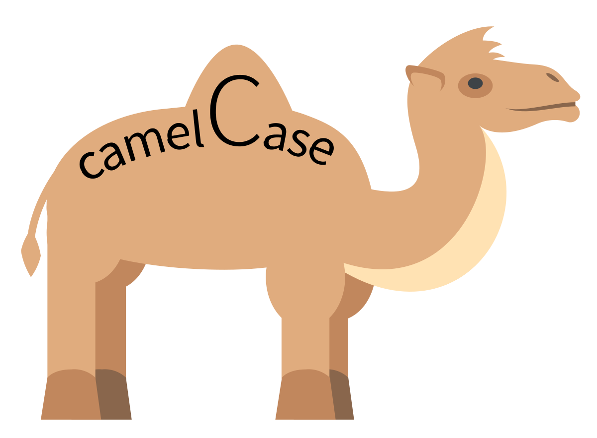
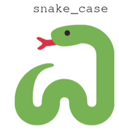
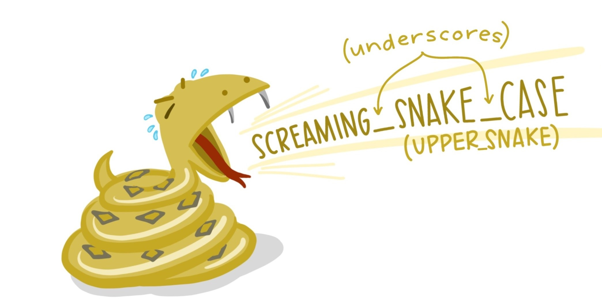
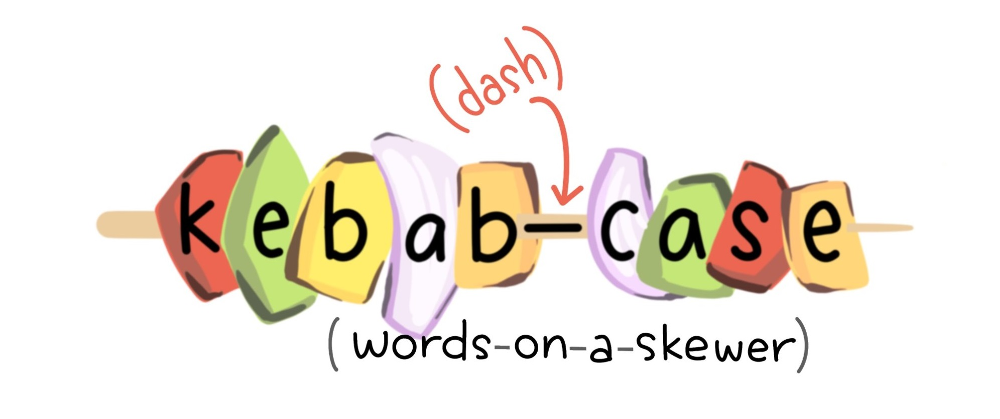

# Casing Styles

The Way how you naming your variable, method or class to be more understandable for all.

* Camel case.
* Pascal case.
* Snake case.
* Kebab case.

## Camel Case



When using camel case, you start by making the first word lowercase. Then, you capitalize the first letter of each word that follows.

So, a capital letter appears at the start of the second word and at each new subsequent word that follows it.

Here are some examples of how you would use camel case:

```java
numberOfDonuts = 34

favePhrase = "Hello World"
```


## Pascal Case


Pascal case is similar to camel case.

The only difference between the two is that pascal case requires the first letter of the first word to also be capitalized.

So, when using pascal case, every word starts with an uppercase letter (in contrast to camel case, where the first word is in lowercase).

Here are some examples of how you would use pascal case:

```java
NumberOfDonuts = 34

FavePhrase = "Hello World"
```


## Snake Case



Snake case separates each word with an underscore character (_).

When using snake case, all letters need to be lowercase.

Here are some examples of how you would use the snake case:

```python
number_of_donuts = 34

fave_phrase = "Hello World"
```

### Screaming snake casing or Upper case snake casing



```python
ORDER_ID
FIRST_NAME
DATE_OF_BIRTH
```

### Camel snake casing

```python
order_Id
first_Name
date_Of_Birth
```

### Pascal snake casing

```python
Order_Id
First_Name
Date_Of_Birth
```


## Kebab case



The kebab case is very similar to snake case.

The difference between snake case and kebab case is that kebab case separates each word with a dash character, -, instead of an underscore.

So, all words are lowercase, and each word gets separated by a dash.

The kebab case is another one of the most human-readable ways of combining multiple words into a single word.

Here are some examples of how you would use kebab case:

```html
number-of-donuts = 34

fave-phrase = "Hello World"
```

### Camel kebab casing

```html
order-Id
first-Name
date-Of-Birth
```

### Pascal kebab casing

```html
Order-Id
First-Name
Date-Of-Birth
```

### Upper kebab casing

```html
ORDER-ID
FIRST-NAME
DATE-OF-BIRTH
```
